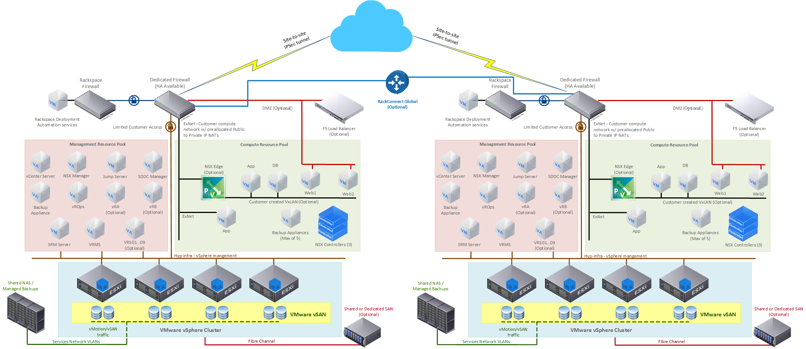

.. _disaster-recovery:

=================
Disaster recovery
=================

The Disaster Recovery (DR) add-on for Rackspace Private Cloud powered by
VMware (RPC-V) consists of two RPC-V environments in two different Rackspace
data centers with the added components of VMware's vSphere Replication and
VMware's Site Recovery Manager (SRM). vSphere Replication consists of
up to 10 virtual appliances, the vSphere Replication Management Server
(VRMS), and up to 9 vSphere Replication Servers, to share the
replication traffic, scaled out as-needed.  SRM consists of a single
Windows VM with Site Recovery Manager installed. The VRMS and VRS(s) virtual
appliances, as well as the SRM server, are deployed into the management
resource pool of the RPC-V environment.

.. toctree::
   :maxdepth: 3

   getting-started.rst
   vsphere-replication.rst
   configuring-vsphere-replication.rst
   srm.rst
   spheres-of-support.rst

RPC-VMware disaster recovery architecture
~~~~~~~~~~~~~~~~~~~~~~~~~~~~~~~~~~~~~~~~~

The following diagram is a standard RPC-V DR configuration:

