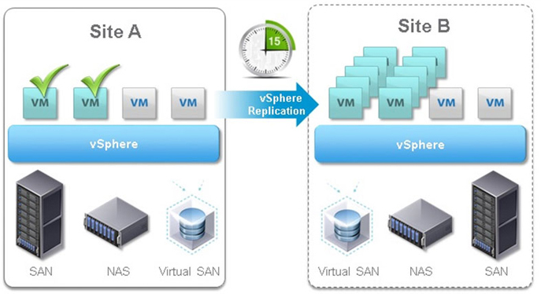

===================
vSphere Replication
===================

VMware vSphere Replication is a hypervisor-based, asynchronous replication
solution for vSphere virtual machines. It is fully integrated with VMware
vCenter Server and the vSphere Web Client. vSphere Replication delivers
flexible, reliable, and cost-efficient replication to enable data protection
and disaster recovery for all virtual machines in your environment.

Hypervisor-based virtual machine replication
~~~~~~~~~~~~~~~~~~~~~~~~~~~~~~~~~~~~~~~~~~~~

vSphere Replication is a deeply integrated VMware vSphere component. It is a
robust hypervisor-based virtual machine replication engine. Any changes
written to the running virtual machine's virtual disk at the primary site are
captured and sent to the secondary site. At the secondary site, the changes
are applied to the virtual machine disks of the offline copy (replica) of the
virtual machine.

Replication management
~~~~~~~~~~~~~~~~~~~~~~

vSphere Replication includes an agent built into vSphere and one or more
virtual appliances deployed by using vSphere Web Client. The agent tracks
and sends changed data from a running virtual machine to a vSphere Replication
appliance at a remote site; the appliance then adds the replicated data to the
offline replica copy for that virtual machine. The vSphere Replication virtual
appliance also manages and monitors the replication process. This gives
administrators visibility into virtual machine protection status and the
ability to recover virtual machines with a few clicks.

Replication configuration
~~~~~~~~~~~~~~~~~~~~~~~~~

Configuring replication for up to 2,000 virtual machines using vSphere Web
Client doesn't require a lot of steps: select one or more virtual machines,
right-click on a virtual machine, and define the RPO and destination for its
replica.  vSphere Replication replicates the data to meet the Recovery Point
Objective (RPO) at all times, ensuring that virtual machine content never ages
past its defined replication policy. RPOs range from 5 minutes to 24 hours and
can be configured on a per-virtual machine basis.

Virtual machine synchronization and seed copies
~~~~~~~~~~~~~~~~~~~~~~~~~~~~~~~~~~~~~~~~~~~~~~~

vSphere Replication can do an initial full synchronization of the source
virtual machine and its replica copy. If desired, a seed copy of data can be
placed at the destination to minimize the time and bandwidth required for the
first replication. A seed copy of a virtual machine consists of a virtual
machine disk file that can be positioned at the target location. A seed copy
is manually created and placed at the recovery location by using any mechanism
the administrator chooses, such as offline copying, FTP, an ISO image, or a
virtual machine clone.

Intelligent transfers
~~~~~~~~~~~~~~~~~~~~~

After the initial full synchronization is complete, vSphere Replication
transfers only data that has been altered. The vSphere kernel tracks unique
writes to protected virtual machines, identifying and replicating only those
blocks that have changed between replication cycles. This keeps network
traffic to a minimum and allows for aggressive RPOs.

 
Non-intrusive replication
~~~~~~~~~~~~~~~~~~~~~~~~~

The virtual machine replication process is non-intrusive and takes place
independently of the operating system or applications in the virtual machine.
It is transparent to protected virtual machines and requires no changes to
their configuration or ongoing management.
