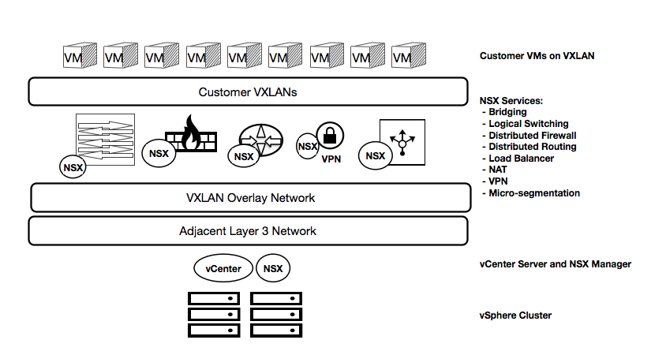

NSX architecture
----------------

The following diagram shows how NSX fits into the architecture of Rackspace
Private Cloud powered by VMware (RPC-VMware). The NSX Manager™ resides in the
management resource pool. During the initial configuration of NSX, three NSX
Controllers™ are deployed in the cluster. Continuing with the configuration
process, VXLAN Tunnel Endpoints (VTEPs) are deployed on the hypervisor so the
hypervisor itself can act as an endpoint to NSX. The VTEPs are deployed to a
dedicated VLAN, and this VLAN is the base for the VXLAN overlay networks that
are created and managed by NSX.

