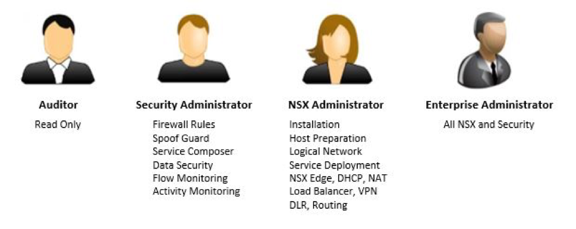

NSX roles and permissions
-------------------------

Customers are given the Enterprise Administrator role to NSX in the RPC-VMware
product. However, an Enterprise Administrator can allocate lesser roles
to individuals to match their job responsibilities.

.. list-table::
   :widths: 30 70
   :header-rows: 1

   * - Role
     - Permissions
   * - Auditor
     - Users in this role can only view system settings and auditing,
       events and reporting information, but cannot make any
       configuration changes.
   * - Security Administrator
     - Users in this role can configure security compliance policies, and can
       view the reporting and auditing information in the
       system.
   * - NSX Administrator
     - Users in this role can perform all tasks related to deployment
       and administration of the NSX Manager instance.
   * - Enterprise Administrator
     - Users in this role can perform all tasks related to deployment
       and configuration of NSX products and administration of the NSX
       Manager instance.

