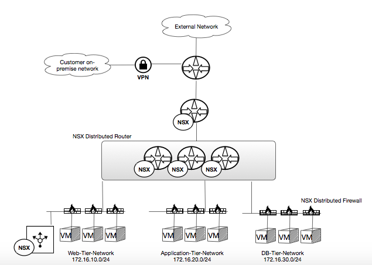
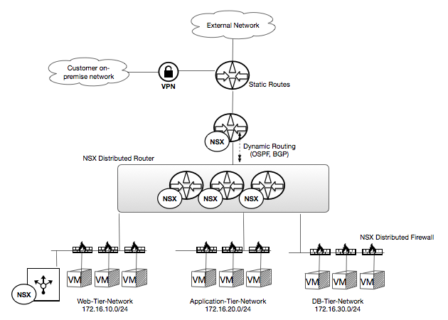
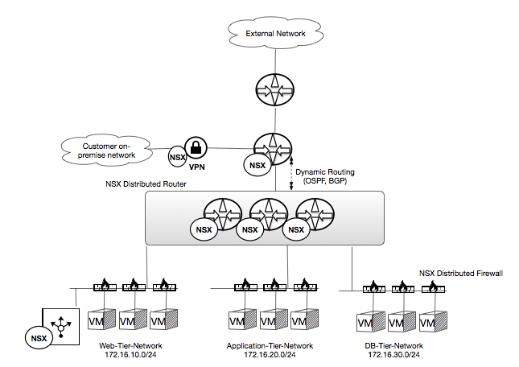

NSX Use Cases
-------------

The following references are some sample customer use cases for NSX
for Rackspace Private Cloud Powered by VMware (RPC-VMware):

-  :ref:`RPC-VMware NSX - Mult-tier Network Use Case <nsx-usecase-01>`

-  :ref:`RPC-VMware NSX - Dynamic Routing Use Case <nsx-usecase-02>`

.. _nsx-usecase-01:

Multi-tier Network Use Case
---------------------------

NSX provides you the ability to create multiple networks in your private cloud
for various purposes, such as providing logical network segments for a 3 tier
application. In this use case, 3 logical switches, a distributed router and
distributed firewall provide logical web-tier, app-tier and db-tier network
segments, including the appropriate routing and security between the tiers.

The distributed logical router (DLR) provides network routing between the
web-tier and the app-tier. It also provides routing between the app-tier and
db-tier. No routing is provided between the web-tier and db-tier.

The distributed firewall (DFW) only allows restricted necessary network
communication between the web-tier and the application tier. The DFW rules can
be granularly limited based on parameters such as the source and target VMs and
types of traffic (such as by TCP port number).

Additionally, the DLR an be configured to allow routing to an external network
via an NSX Edge Gateway. In this case, the DFW and the NSX Edge firewalls can
be used to permit, granularly controlled communication between the external
network and the web-tier, while completely disallowing any external
communication with the other tiers.

Additionally, a “one-armed” edge device can be used to provide additional
network services in the web-tier, such as load balancing and DHCP.

REF:
https://blogs.vmware.com/networkvirtualization/2014/07/getting-started-vmware-
nsx-part-ii-building-virtual-networks.html/

.. _nsx-usecase-02:

Dynamic Routing Use Case
------------------------

The physical firewall used to protect your RPC-VMware private cloud is not
configured with dynamic routing. So, in order to allow your on-premise network
or other external networks to communicate to your NSX network segments, you
will need to request that Rackspace configure statics routes on the physical
firewall. Consider requesting a summary route for all networks you may build in
the NSX environment.

Alternatively, you can choose to terminate your VPN to the NSX Edge, instead of
the physical firewall. To facilitate this, the DLR and the NSX Edge can be
configured to use dynamic routing, ensuring the NSX Edge is aware of the
available, routed networks provided by the DLR.

