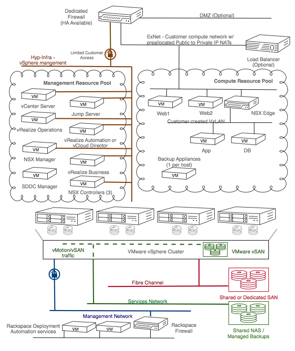

.. _getting_started:

===============================
Getting started with RPC-VMware
===============================

RPC-VMware offers you the ability to quickly expand data center capacity
without the need for further investment in physical assets.
With direct access to the VMware APIs, you can use your
existing scripts, and the same VMware and third-party tools to easily manage
the hosted VMware environment. Improving agility by helping to eliminate
long procurement lead times, ensuring you readily meet new business demands
while maintaining control.

RPC-VMware is a dedicated hosted cloud dedicated, containing core
components including:
* vCenter
* vSphere
* VMware NSX
* VMware vRealize Operations

.. note::

   If you include all of the above components, you can implement a
   private cloud offering with on-demand, self-service features for deploying
   and managing applications and infrastructure in a SDDC.

.. _rpcv-architecture:

RPC-VMware architecture
~~~~~~~~~~~~~~~~~~~~~~~

The following diagram shows the architecture of RPC-VMware as configured with
optional add-on components.

|Architecture2|

.. _rpcv-features:

RPC-VMware features
~~~~~~~~~~~~~~~~~~~

The core features of RPC-VMware are based on the underlying VMware vCenter
Server and VMware vSphere products. These features include the following
capabilities:

-  Deploying virtual machines (VMs) on-demand into clusters that are
   preconfigured for high availability and load balancing.

-  Running your VMs on dedicated hypervisors with preconfigured datastores and
   networks.

-  Migrating VMs on-demand between hypervisors and datastores.

-  Resizing VMs on-demand.

The following table provides details about the Managed Backup (MBU) for
Management Services feature. If any component of your RPC-VMware cloud
encounters a failure, Rackspace might determine that a restore of the component
is required. If you want to request a restore of any component, contact your
account team.

.. list-table::
   :widths: 30 70
   :header-rows: 1

   * - Feature
     - Description
   * - File-level backup and restore
     - Some of the management services allow file-level backups and where
       necessary, Rackspace uses file-level backups.
   * - Image-level backup and restore
     - All VMs and appliances in the management resource pool are backed up at
       an image level for a complete system backup.

You can choose to use additional features in your RPC-VMware. These
features include the following capabilities:

-  Deploying and managing a virtual network built on software-defined
   networking, where you configure switching, routing, and security on-demand.

-  Deploying VMs onto software-defined storage, where you can control the
   performance and availability policies with VM granularity.

-  Providing Quality of Service (QoS) and operational efficiency in your
   private cloud with minimum manual effort by leveraging software-based cloud
   operations and analysis services.

-  Use cloud management services to provide your applications, VMs, and SDDC
   as on-demand services.

-  Rely on image-level backups of all VMs in your private cloud without the
   need to install a backup agent within the VM.

-  Request on-demand database administration support by Rackspace database
   administrators (DBAs).

-  SQL AlwaysOn Availability Groups (AAG) are natively supported on vSAN, the
   main storage platform for RPC-VMware. For customers interested in Failover
   cluster Instances (FCI), you can use additional Dedicated or Shared SAN
   Rackspace solutions. Interested Customers, contact our support team for
   assistance.

For details about the currently available optional add-on features,
contact your account team.

.. _roles-permissions:

RPC-VMware roles and permissions
~~~~~~~~~~~~~~~~~~~~~~~~~~~~~~~~

To implement the separation of customer and Rackspace duties in RPC-VMware,
Rackspace uses built-in and custom roles in the vCenter Server. Rackspace
assigns you a maximum permission role (customer role) and any lesser
privileged roles that you request for specific users or groups.

Customers have permissions to create, delete, and manage VMs within their
private cloud.
Rackspace manages and maintains the ESXi hosts, the vCenter Server,
Platform Services Controller, and additional management VMs as required
by the RPC-V solution. Customers therefore have limited permissions on hosts
and management servers.

Specific resource pools and folders are created to house customer created VMs
and ensure separation from management VMs. In support of this separation,
customers are granted permissions to create, delete, and manage VMs in the
``Compute-ResourcePool`` and ``Network-ResourcePool`` resource pools and in
the ``Workloads``, ``Templates`` and ``Networking VMs`` virtual machine
folders.

If required for organisational or resource management purposes, customers can
create new resource pools below the ``Compute-ResourcePool`` and
``Network-ResourcePool``, and new folders below the ``Workloads``,
``Templates`` and ``Networking VMs`` folders.

The following permission sets are predefined in the vCenter Server:

-  Customer Access
-  VM Power User
-  VM User
-  Read Only

Customer Access permission set is a product of permissions applied to two
sets of roles. A lower permission set is enforced at the root of the
inventory tree, and a higher permission set is applied at the resource
pool level of the inventory tree.

The following table shows which vCenter Server permissions are available to
each role.

**vCenter permissions and roles**

.. list-table::
   :widths: 20 20 20 20 20
   :header-rows: 1

   * - Permission
     - Customer Access
     - VM Power User
     - VM User
     - Read Only
   * - Alarms
     - Full access
     - No access
     - No access
     - No access
   * - Datastore
     - Limited access
     - Limited access
     - No access
     - No access
   * - Folder
     - Full access
     - No access
     - No access
     - No access
   * - Network
     - Limited Access
     - No access
     - No access
     - No access
   * - Performance
     - Full access
     - No access
     - No access
     - No access
   * - Profile-driven storage
     - Full access
     - No access
     - No access
     - No access
   * - Resource
     - Full access
     - No access
     - No access
     - No access
   * - Scheduled task
     - Full access
     - Full access
     - Full access
     - No access
   * - Tasks
     - Full access
     - Full access
     - Full access
     - No access
   * - vApp
     - Full access
     - No access
     - No access
     - No access
   * - Virtual machine
     - Full access
     - Full access
     - Limited access
     - No access
   * - Datacenter
     - Limited access
     - No access
     - No access
     - No access
   * - Global
     - Limited access
     - Limited access
     - Limited access
     - No access
   * - Host
     - Limited access
     - No access
     - No access
     - No access
   * - Sessions
     - Limited access
     - No access
     - No access
     - No access
   * - Storage views
     - Limited access
     - No access
     - No access
     - No access
   * - Datastore cluster
     - Full Access
     - No access
     - No access
     - No access
   * - Distributed virtual switch
     - No access
     - No access
     - No access
     - No access
   * - Distributed virtual port group
     - No access
     - No access
     - No access
     - No access
   * - ESX agent manager
     - No access
     - No access
     - No access
     - No access
   * - Extension
     - No access
     - No access
     - No access
     - No access
   * - vCenter inventory service
     - No access
     - No access
     - No access
     - No access
   * - vSphere update manager
     - No access
     - No access
     - No access
     - No access
   * - VRM policy
     - No access
     - No access
     - No access
     - No access
   * - vService
     - No access
     - No access
     - No access
     - No access
   * - vSphere tagging
     - Full Access
     - No access
     - No access
     - No access

.. _rpcv-managed-services:

Managed services for RPC-VMware
~~~~~~~~~~~~~~~~~~~~~~~~~~~~~~~

The following table provides describes the features that Rackspace provides
as a managed service to you in RPC-VMware.

**Features provided as managed services**

.. list-table::
   :widths: 30 70
   :header-rows: 1

   * - Feature
     - Description
   * - High Availability (HA)
     - HA clustering is set up by Rackspace.
   * - Dynamic Resource Scheduler (DRS)
     - DRS clustering is set up by Rackspace.
   * - vStorage API for Array Integration (VAAI)
     - VAAI is available if it is supported on the storage array.
   * - Distributed Switch™
     - Rackspace configures the distributed virtual switch and distributed
       port groups to which customers can connect VMs.

.. _support:

Spheres of support for RPC-VMware
~~~~~~~~~~~~~~~~~~~~~~~~~~~~~~~~~

This section lists the areas that are considered managed by Rackspace, and
the areas that require you to manage them.

**Rackspace managed**

.. list-table::
   :widths: 30 70
   :header-rows: 1

   * - Area
     - Managed by Rackspace
   * - Virtualization
     - Management service VMs and appliances
   * - Hardware
     -

       - Manage delivery of equipment

       - Procure, inventory spare parts, and break-fix equipment

       - Rackspace Dedicated Server (hypervisor)

       - Rackspace Fully Managed Dedicated NAS

       - Rackspace Fully Managed Dedicated SAN

       - Rackspace Fully Managed Shared SAN
   * - Network
     -

       - Architecture design, review, and consultation

       - Configure physical routing and switching equipment

       - Allocate public and private IP blocks for guest OS VMs

       - Manage physical firewalls

       - Manage physical load balancers

       - Manage physical intrusion-detection systems

       - Monitor bandwidth consumption

       - Troubleshoot network connectivity

       - Manage physical firewall rule set (co-managed with customer)
   * - Monitoring
     -

       - Configure and respond to infrastructure monitoring (ping and port)

       - Configure and respond to RPC-VMware services monitoring
   * - Security
     -

       - Maintain RPC-VMware security

**Customer managed**

.. list-table::
   :widths: 30 70
   :header-rows: 1

   * - Area
     - Managed by customer
   * - Virtualization
     -

       - VM troubleshooting

       - Remote administration of VMs
   * - Network
     -

       - IP management of IP blocks assigned for all guest OS VMs

       - Manage physical firewall rule set

       - Manage VM DNS
   * - Monitoring
     -

       - Provide, configure, and respond to monitoring of the OS and
         applications on compute VMs

       - Monitor for capacity utilization and request additional capacity
         in advance
   * - Operating systems
     -

       - Provision guest OS

       - Ensure OS licensing compliance

       - Patch OS
   * - Security
     - Maintain security specifications for VMs

.. _rpcv-compatibility:

RPC-VMware compatibility
~~~~~~~~~~~~~~~~~~~~~~~~

RPC-VMware might not be compatible with all Rackspace products and services.
Contact your Rackspace support specialist for detailed information about
whether any specific Rackspace product is compatible with your RPC-VMware.

RPC-VMware compatibility with third-party products
--------------------------------------------------

You can access RPC-VMware by using various VMware services APIs. You can use
any third-party management, orchestration, or other type of tools that are
compatible with these APIs. In this case, the functionality of any such tool
is limited by the RPC-VMware features and capabilities as described in this
handbook, and the permissions applied to your RPC-VMWare environment. Ensure
that the VMware services API versions of your environment are compatible
with the third-party tools that you want to use.

RPC-VMware compatibility when elevated permissions are needed
-------------------------------------------------------------

In some cases, existing role permissions provided by Rackspace do not allow
a custom or third-party tool to function. Contact the Rackspace account team
to determine if role permission adjustments are possible.

.. _rpcv-authentication:

RPC-VMware authentication methods
~~~~~~~~~~~~~~~~~~~~~~~~~~~~~~~~~

RPC-VMware customers have two choices for vCenter authentication:

* Rackspace-provided Active Directory service
* Customer-provided Active Directory service

Rackspace support authenticates to your RPC-VMware cloud with the
Rackspace hosted directory service. Your directory service is added as an
additional authentication source.

You must also indicate the groups and roles to be assigned in vCenter from
the vCenter roles available in
:ref:`RPC-VMware roles and permissions<roles-permissions>`.

External data centers
~~~~~~~~~~~~~~~~~~~~~

In addition to being available in Rackspace data centers, the RPC-VMware
product is also available in customer's own, or 3rd party, data centers.

External instances of RPC-VMware provide the same functionality as it would in
a Rackspace data center. Rackspace provides and supports the networking,
including redundant connections back to Rackspace to enable a seamless support
experience for the customer.

Spheres of support for external data centers
--------------------------------------------

Rackspace teams perform the hardware troubleshooting at the customer or 3rd
party data center and have partnered with hardware vendors for hardware
replacement.

.. list-table::
   :widths: 30 20 20 20
   :header-rows: 1

   * - Task
     - Customer
     - Vendor
     - Rackspace
   * - Software troubleshooting
     -
     -
     - Rackspace support team
   * - Server hardware replacement
     -
     - 4-6 hour mission critical support from vendor
     -
   * - Network hardware replacement
     -
     - 4 hour call to repair from vendor
     -
   * - On-site troubleshooting at datacenter
     - Customer's datacenter team (if in place), or co-location datacenter
       support team
     -
     - Rackspace support team

Pay-Per-Use Infrastructure
~~~~~~~~~~~~~~~~~~~~~~~~~~

RPC-VMware with Pay-Per-Use Infrastructure, delivered by Rackspace and
Hewlett Packard Enterprise® (HPE) offers a pay-per-use billing model for
customers. This is differentiated from traditional fixed cost private
infrastructure environments where customers pay for everything up front,
pay by the month for a low utilized environment, or do both. A minimum
commitment is required for this solution.

Customers are billed on a per-unit basis for compute and storage resources
consumed (assuming that usage exceeds the minimum commit level). The per-unit
prices are "all-in" - they cover the hardware and hardware management in
addition to the cost of private cloud operations, support, and licensing.
Pricing is determined per customer deployment and is dependent on installed
capacity and expected growth. This per-unit pricing will also reduce as the
customer’s environment grows and consumption increases over the duration of
the contract. This allows the customer to predict their growth costs with
no hidden fees.

How It Works
------------

A monitoring agent is installed on each VMware Private Cloud to meter usage.
This agent monitors hourly consumed resources on your private cloud (for
example, the hourly RAM consumed on a daily basis across all the compute
hosts).  The usage is averaged for the day and at the end of each month that
Rackspace aggregates the daily usage to determine the monthly usage. Then the
appropriate per unit price is applied from the pricing table. Rackspace
monitors the customer’s usage constantly and recommends adding new resources
or hosts into the private cloud environment as the customer’s usage exceeds
the thresholds of installed capacity. New resources are seamlessly integrated
into the existing private cloud allowing customers to grow their environment
without any downtime.

For more information about Pay-Per-Use with RPC-V, contact your Rackspace
sales representation.

.. note::
   Pay-Per-Use is available for RPC-VM deployments at customer or
   colocation data centers.
