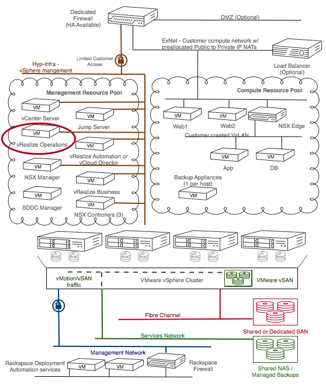

.. _vrops-architecture:

vRealize Operations architecture
--------------------------------

The vRealize Operations add-on for RPC-VMware is implemented as a single
virtual appliance that contains all the required services. The appliance is
deployed to the management resource pool.

