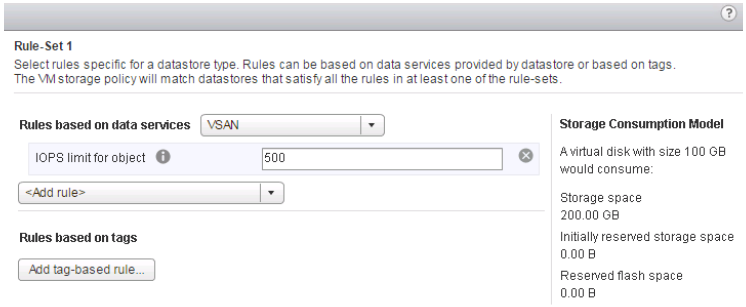

=========================
Using vSAN for RPC-VMware
=========================

This section provides instructions for using the vSAN
component of RPC-VMware.

Access control
--------------

From vCenter, your customer role uses access control to determine what
permissions you have.

Capacity management
-------------------

For information about managing capacity, see :ref:`vRealize Operations vSAN
Management Pack<vsan-vros-mgmt-pack>`.

Performance monitoring
----------------------

For more information, see :ref:`vRealize Operations vSAN
Management Pack<vsan-vros-mgmt-pack>`.

Quality of service IOPS limits
------------------------------

vSAN includes a quality of service (QoS) feature that limits the number of
input/output operations per second (IOPS) that an object can consume.

QoS is a storage-policy-based management (SPBM) rule. Because QoS is applied
to vSAN objects through a storage policy, you can apply it to individual
components or the entire VM without interrupting the operation of the VM.

QoS for vSAN is normalized to a 32 KB block size, and treats reads the
same as writes. An example with an IOPS limit of 500 (regardless of block
size up to 32 KB) will result in 500 IOPS, while a block size of 64 KB
would result in 250 IOPS. It is important to consider the workload profile
when configuring IOPS limits.

Deduplication and compression
-----------------------------

The deduplication and compression feature is enabled on VSAN clusters based on
customer responses to implementation questions. It requires the correct number
of hosts and all flash storage. The amount of storage reduction from
deduplication and compression cannot be configured or guaranteed. It depends on
many factors, including the type of data stored and the number of duplicate
blocks. For example, the deduplication ratio tends to increase in new clusters
as data is added and the opportunity to find duplicate data blocks rises.

If a customer does not elect to enable deduplication and compression initially,
but chooses to enable it at a later date, the customer must submit a ticket
requesting the change and specify whether or not they will allow reduced
redundancy while the change is being applied. Enabling deduplication and
compression requires a rolling reformat of every disk group on every host. To
accomplish this change, Virtual SAN evacuates data from the disk group, removes
the disk group, and recreates it with a new format that supports deduplication
and compression. The enablement operation does not require virtual machine
migration or DRS. In certain environments, your Virtual SAN cluster might not
have enough resources for the disk group to be fully evacuated. You may still
be able to enable deduplication and compression using the ``Allow Reduced
Redundancy`` option. This option keeps the VMs running, but the VMs might be
unable to tolerate the full number of failures defined in the VM storage
policy. As a result, temporarily during the format change for deduplication and
compression, your virtual machines might be at risk of experiencing data loss.
Virtual SAN restores full compliance and redundancy after the format conversion
is completed.

Storage-based policy management
-------------------------------

Users with the appropriate role and permission can create and administer
VMs and policies.

Each VM deployed on vSAN contains a set of objects, such as VMDKs and
snapshots. Each object contains a set of components determined by the
capabilities configured in the VM storage policy. If the policy contains
a stripe width, the associated object is striped across multiple devices
in the capacity tier. Each stripe is a component of the object.

vSAN might stripe an object across multiple disks, even if the policy
is one stripe. Normally, this action occurs when an administrator requests
the creation of a VMDK that is too large to fit on a single physical
drive. Because the maximum component size is 255 GB, objects that are
greater than 255 GB are automatically be divided into multiple components.
For example, if an administrator deploys a 2 TB VMDK, eight or more
components are created in the same RAID-0 stripe configuration.

For a walkthrough of assigning policies, see the `VMware product
walk-throughs site
<https://featurewalkthrough.vmware.com/#!/virtual-san/virtual-san-feature-walkthrough/assign-policy-to-vm/1_>`_.

.. _vsan-vros-mgmt-pack:

vRealize Operations vSAN Management Pack
----------------------------------------

The vRealize Operations Management Pack for vSAN is
installed and configured by default in RPC-VMware. To use the management pack,
see the
`Connecting to vRealize Operations section in the vRealize Operations handbook
<https://www.vmware.com/support/pubs/vrealize-operations-manager-pubs.html>`_
for instructions about logging in.

With the vSAN management pack, you can perform the following tasks:

- Monitor and proactively alert on vSAN problems via Alert
  Groups for health, capacity, and configuration (based on the vSAN health
  checks).
- Identify vSAN clusters running out of capacity now or soon.
- Compare non-vSAN and vSAN clusters to deploy or balance workloads and
  optimize for performance and utilization.

For a walkthrough of using the management pack, see the `VMware Feature
Walkthrough site
<https://featurewalkthrough.vmware.com/#!/virtual-san/virtual-san-feature-walkthrough/vrealize-operations-mpsd/1>`_.

Health checks
-------------

Customers can view health checks. For a walkthrough of this feature,
see the `VMware Feature Walkthough site
<https://featurewalkthrough.vmware.com/#!/virtual-san/virtual-san-feature-walkthrough/health-check-2>`_.

VMware recommends that you use the Health Check plug-in to perform
initial triage of any vSAN problems. A detailed description of the
operational aspects of the health check are located in the `VMware
Virtual SAN Health Check Plugin Guide
<http://www.vmware.com/content/dam/digitalmarketing/vmware/en/pdf/products/products/vsan/vmw-gdl-vsan-health-check.pdf>`_.
