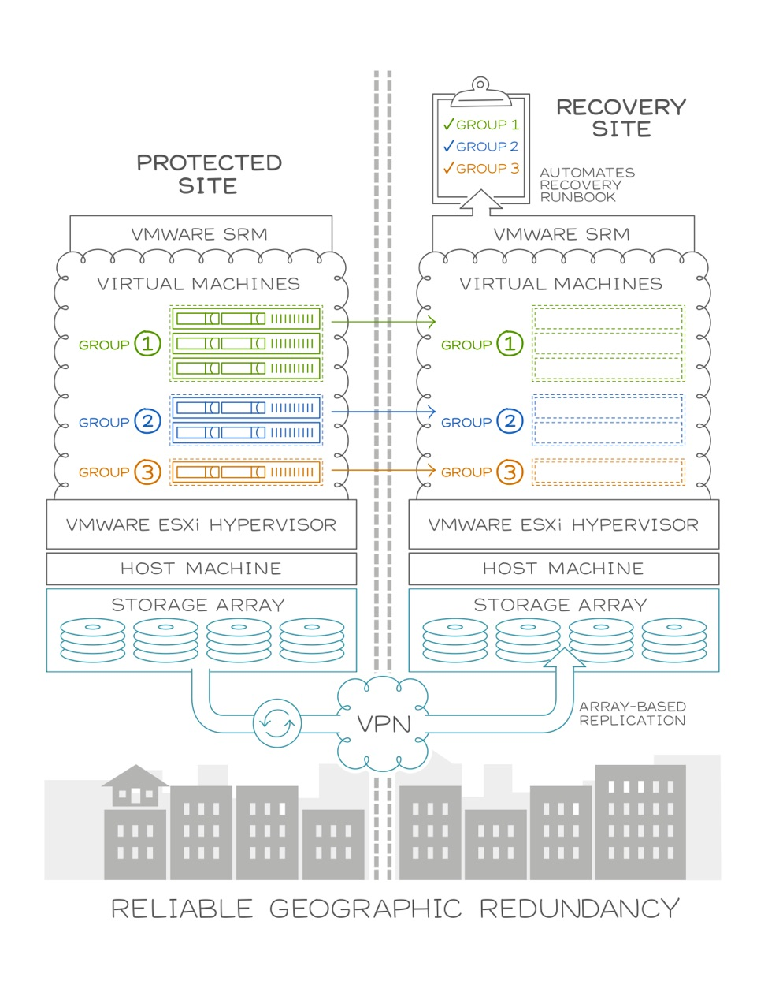

===================
Replication Manager
===================

Replication Manager is a fully managed Replication Service for VMware Server
Virtualization environments hosted in the Rackspace data centers. Powered by
VMware vCenter Site Recovery Manager and Array-Based Replication, Replication
Manager is targeted to meet the most aggressive Recovery Point and Recovery
Time Objectives (RPO and RTO) for the business-critical workloads of customers
who lack the expertise to replicate and recover their data in the event of a
disaster.
Replication Manager is an add-on service for VMware Server Virtualization that
utilizes VMware vCenter Site Recover Manager (SRM) to automate portions of
the customer’s disaster recovery (DR) plan. SRM is an orchestration tool that
relies on Rackspace's Array-Based Replication to deliver fast and reliable
recovery when disaster strikes. Array-Based Replication (powered by EMC®
RecoverPoint, NetApp® SnapMirror®, or Native Unity Replication) replicates
VMware Server Virtualization VMs between data centers and provides automated
and managed failover recovery with RPO as low as one hour and RTO Service
Level Agreement (SLA) that are based on actual customer's failover tests.

Architecture
~~~~~~~~~~~~

The following diagram illustrates the architecture of Replication Manager.

Key features
~~~~~~~~~~~~

Following are some of the key features of the Replication Manager service:

- Production recovery plan: A plan containing protection groups and VMs that
  can be executed in Replication Manager for failover testing, planned
  migration, or unplanned failover.
- Failover testing: The execution of the recovery plan in a way that is
  non-disruptive to the production VMs and applications. It is commonly used to
  verify that the recovery plan can be successfully executed and allows
  Rackspace to define the Recovery Time SLA. During a failover test, the
  customer can perform tests to verify that they are addressing all the
  dependencies of their applications to ensure successful failover.
- Planned migration: The execution of the recovery plan to reverse the roles of
  the production and recovery sites.
- Unplanned failover: The execution of the recovery plan in response to
  a disaster or unplanned outage at the  production site, such that
  the VMs are migrated and running at the recovery site.
- Recovery SLA: An agreement where Rackspace establishes a Guaranteed Recovery
  Time (GRT) for unplanned failover that is defined as double the Actual
  Recovery Time (ART) measured during the most recent failover test.
- MyRackspace portal integration: Features in the MyRackspace web portal that
  allows Replication Manager customers to view protected VMs, protection
  groups, and recovery plans. This integration allows the user to request and
  monitor failover tests, planned migrations, and unplanned failovers.

Roles and responsibilities
~~~~~~~~~~~~~~~~~~~~~~~~~~

The following table identifies the roles and responsibilities for the customer
and Rackspace.

.. list-table::
   :widths: 20 40 40
   :header-rows: 1

   * - Item
     - Customer
     - Rackspace
   * - Business Continuity/Disaster Recovery (BC/DR)
     - Creates and maintains BC/DR plan and procedures.
     - Offers hosted solutions and other Rackspace replication
       solutions that customers can implement based on their BC/DR plans.
   * - Networking
     - Defines target network for VMs during test and failover.
     - Configures target networks.
   * - Monitoring
     -
     - Monitors replication operations, replication space utilization,
       and recovery plan consistency.
   * - Data replication
     - Defines replication frequency.
     - Configures storage replication frequency.
   * - Recovery Time Objective (RTO)
     - Defines desired RTO and requests appropriate hardware.
     - Recommends appropriate hardware to support RTO and provides a
       Recovery Time SLA.
   * - Recovery Point Objective (RPO)
     - Defines desired RTO and requests appropriate hardware.
     - Recommends appropriate hardware to support RPO and configures
       replication.
   * - Define/Change recovery plan
     - Defines and maintains recovery plan.
     - Implements the recovery plan.
   * - Customer applications
     - Configures applications for recoverability at target site.
     -
   * - Test recovery plan
     - Develops scope and objectives for testing. Requests a test at
       least 15 days in advance via the MyRackspace portal or phone.
       Conducts testing at the target site and verifies functionality.
     - Facilitates and monitors tests. Provides results of recovery plan
       execution to customer. Uses the results to modify the Guaranteed
       Recovery Time in the Recovery Time SLA.
   * - Recovery test cleanup
     - Confirms the conclusion of test. Documents changes needed in
       production systems.
     - Performs cleanup operation and notifies customer that the cleanup
       is complete.
   * - Planned migration
     - Develops scope and objectives for migration. Requests a migration
       at least 15 days in advance via the MyRackspace Portal or phone.
       Requests failover of any additional resiliency services. Verifies
       functionality at the target site. Requests migration back to
       source site or requests to remain at the target site within 7 days.
       Requests migration back to source site or requests to remain at
       the target site within 7 days.
     - Facilitates and monitors planned migration. Performs reprotect
       process, reversing protection from the target back to the source
       site. Provides results of recovery plan steps to customer.
       Reconfigures Rackspace services for VMs at target site.

Using Replication Manager in MyRackspace portal
~~~~~~~~~~~~~~~~~~~~~~~~~~~~~~~~~~~~~~~~~~~~~~~

In addition to the standard VMware Server Virtualization features, the
MyRackspace web portal provides features specifically for Replication Manager
users.

Viewing the recovery plan
-------------------------

Use the following steps to view the recovery plan:

#. In the MyRackspace portal menu, select ``Products``, and then ``VMware
   Server Virtualization``.
#. Click on the ``Replication Manager`` tab.
#. In the list of recovery plans, click on the name of one of the plans.
#. You can now see the plan details, such as its protection groups, peer
   location, and peer status.

Viewing a VM’s replication status and other details
---------------------------------------------------

Use the following steps to view replication status and other details:

#. In the MyRackspace portal menu, select ``Products``, and then ``VMware
   Server Virtualization``.
#. Select the ``Virtual Machines`` tab.
#. Use the ``Search`` box (or scroll through the list) to locate a specific VM.
#. Examine the value of the ``Replication`` column for the VM. This is
   typically, ``Protected`` or ``Not Protected``.
#. Click on the name of the VM.
#. You can now see the VM details, such as its protection group, group status,
   and peer status.

Viewing protection group details
--------------------------------

Use the following steps to view protection group details:

#. In the details page of a recovery plan or a VM, click on the name of a
   protection group.
#. You can now see the group’s details.

Requesting a failover test
--------------------------

Use the following step to request a failover test:

#. In the details page of a recovery plan, use the ``Action`` dropdown to
#. In the wizard, provide the appropriate details and submit.
#. In the MyRackspace portal menu, select ``Tickets``, and then ``Ticket
   List``.
#. In the list of tickets, drill into the ticket that you just created.

Requesting a planned migration
------------------------------

Use the following steps to request a planned migration:

#. In the details page of a recovery plan, use the ``Action`` dropdown to
   select ``Planned Migration``.
#. In the wizard provide the appropriate details and submit.
#. In the MyRackspace portal menu, select ``Tickets``, and then ``Ticket
   List``.
#. In the list of tickets, drill into the ticket that you just created.

Request a unplanned failover
----------------------------

.. important::

   In the event of an unplanned failover, engage the Rackspace VMware Support
   team as soon as possible.

   Your company may assign individuals with the authority to declare a
   disaster. However, in such an event, Rackspace will always verify that the
   user requesting the failover has the appropriate admin permissions to make
   request. See :ref:`Managing permissions <svh-manage-permissions>`
   to ensure your users have the appropriate permissions.

Use the following steps to request a unplanned migration:

#. In the details page of a recovery plan, use the ``Action`` dropdown to
   select ``Unplanned Failover``.
#. In the wizard provide the appropriate details and submit.
#. In the MyRackspace portal menu, select ``Tickets``, and then ``Ticket
   List``.
#. In the list of tickets, verify the new ticket appears with the proper
   details.

Official terms and conditions
~~~~~~~~~~~~~~~~~~~~~~~~~~~~~

See the official terms and conditions at the following locations:

- `Replication Manager terms and conditions <https://www.rackspace.com/information/legal/replicationmgrterms>`_
- `Rackspace (Intensive) terms and conditions <https://www.rackspace.com/information/legal/intensiveterms>`_
