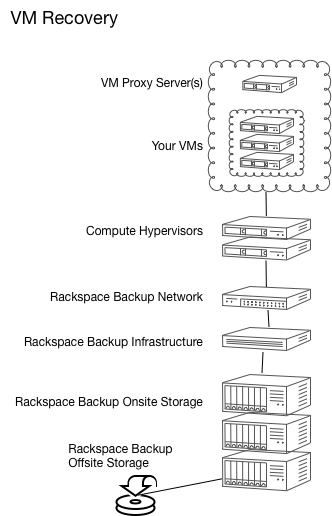

.. _svh-vm-recovery:

===========
VM Recovery
===========

Virtual Machine Recovery is a fully-managed backup and recovery service
provided by Rackspace specifically for VMware Server Virtualization
environments that are hosted in the Rackspace data centers. It is powered by
Rackspace Managed Backup and VMware’s API for Data Protection (VADP). It
provides 24-hour RPO and 12-hour RTO.

Architecture
~~~~~~~~~~~~

The following diagram illustrates the architecture of VM Recovery.

Key features
~~~~~~~~~~~~

Following are some of the key features of VM Recovery:

- Fully managed backup and recovery 24x7x365.
- VM image-level backup and recovery.
- Individual file-level backup and recovery.
- Database and application specific backup and recovery (using guest OS
  agents).
- 24-hour Recovery Point Objective (RPO) and 12-hour Recovery Time Objective
  (RTO).
- Rackspace initiation of restoration of customer data stored onsite within 2
  hours of the time customer requests the restore via a support ticket.
- Rackspace initiation of restoration of customer data stored offsite within
  6 hours of the time customer requests the restore via a support ticket.
- Providing the following benefits when compared to guest OS based
  technologies:

  - Smaller backup window.
  - Protected powered-off VMs.
  - Reduced load on ESXi host and VMs.
  - Increased recovery scenarios (provides VM image-level backup and recovery).
  - Faster RTOs.

- MyRackspace portal allowing the customer to view backup configuration,
  status, and history. Also enables the customer to request backup policy
  changes and submit restore requests.

Roles and responsibilities
~~~~~~~~~~~~~~~~~~~~~~~~~~

The following table identifies the roles and responsibilities for the
customer and Rackspace.

.. list-table::
   :widths: 20 40 40
   :header-rows: 1

   * - Category
     - Customer
     - Rackspace
   * - Backup
     - Defines the backup and recovery requirements for VMs and applications.
     - Implements the appropriate hypervisor proxies, VM configuration and
       application backup agents.
   * - Monitoring
     -
     - Monitors backup operations.
   * - Recovery
     - Requests full VM, individual file, or application-level recovery as
       needed.
     - Performs the recovery.

Official terms and conditions
~~~~~~~~~~~~~~~~~~~~~~~~~~~~~

- A minimum of 15% free disk space is required on all VMware datastores
  containing virtual machines. Virtual machine backup jobs are stopped if less
  than 5% free disk space is available.
- VM Recovery Proxy uses VMware hypervisor snapshot functionality as a basis
  for backups and supports backups of up to 4 virtual machines simultaneously
  and up to a total of 40 virtual machines or 3TB of data within 24 hours.
- VM Recovery Proxy provides file, folder, and virtual machine image recovery
  options.
- Backup and restore times depend on usage of hypervisor and network during
  running processes.
- Client-based data de-duplication is utilized in order to reduce backup times.

See the official terms and conditions at the following locations:

- `Rackspace (Intensive) terms and conditions <https://www.rackspace.com/information/legal/intensiveterms>`_
- `Rackspace Dedicated Hosting Product terms <https://www.rackspace.com/information/legal/DedicatedHostingTerms>`_
