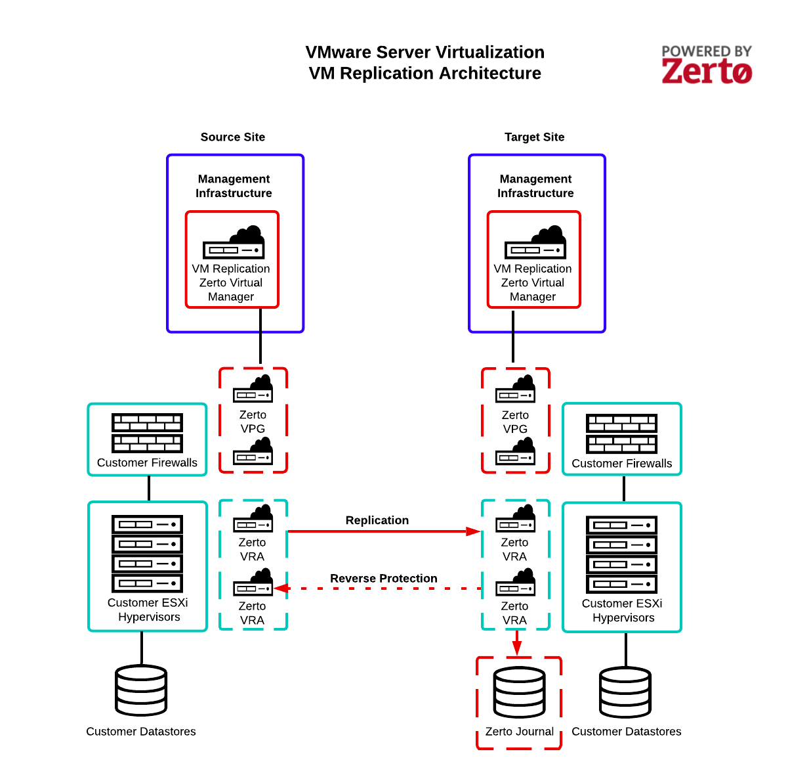

.. _svh-vm-replication:

==============
VM Replication
==============

VM Replication Enhanced Edition is powered by the Zerto® IT Resilience
Platform™ and enables you to deliver a fully managed always-on experience to
your customer. VM Replication provides near-continuous storage-agnostic data
replication enabling the recovery of virtual machines from business-impacting
events such as ransomware, hardware failures, or even natural disasters with
Recovery Point Objectives (RPOs) and Recovery Time Objectives (RTOs) measured
in seconds and minutes.

Architecture
~~~~~~~~~~~~

The following diagram illustrates the VM Replication architecture, including
the following key components:

**Zerto Virtual Manager (ZVM)**
- Rackspace’s central management interface for replication and recovery

**Zerto Virtual Replication Appliance (ZRA)**
-	Responsible for VM block-level replication
-	One per source and target hypervisor

**Zerto Virtual Protection Group (VPG)**
-	Multi-VM consistency grouping mechanism
-	Protect, recover, and test VMs together

**Zerto Journal**
-	Dynamic record of every change in the source VM’s history

Key features
~~~~~~~~~~~~

The following features are some of the key capabilities of VM Replication:

- Continuous data protection with hypervisor-based block-level replication
- Consistent recovery of the entire application by protecting multiple VMs
  together in Virtual Protection Groups
- Rewind and recover to the second with point-in-time recovery for seamless
  roll-back to moments before ransomware with approximately five-second
  increments – for up to seven days
- Complete automation and orchestration of virtual machine non-disruptive test
  failovers, migrations, and live recoveries with no manual steps
- Automated testing to ensure recoverability with no impact on production
- Reports for full compliance with regulations like Health Insurance
  Portability and Accountability (HIPAA), Payment Card Industry (PCI), and
  General Data Protection Regulation (GDPR)

Roles and responsibilities
~~~~~~~~~~~~~~~~~~~~~~~~~~

The following table identifies the roles and responsibilities of the
customer and Rackspace:

.. list-table::
   :widths: 30 70
   :header-rows: 1

   * - Designated party
     - Description
   * - Rackspace
     - Rackspace is responsible for performing the task.
   * - Customer
     - Customer is responsible for performing the task.
   * - Customer (with Rackspace Support)
     - Customer is responsible for performing the task with escalation available
       to Rackspace support.
   * - Rackspace (customer initiated)
     - Rackspace is responsible for performing the task but the actions are
       expected to be initiated by the customer.
   * - Not available
     - The task or option is technically possible, but it is not available for the
       listed solution.

**Sizing**

.. list-table::
   :widths: 60 20 20
   :header-rows: 1

   * - Task
     - Standard Edition
     - Enhanced Edition
   * - Provide requirements for Virtual Protection Groups (VPGs) that group VMs
       together for the purposes of protection, testing, and recovery and
       ensure write-order fidelity across the VMs
     - Rackspace
     - Customer
   * - Provide point-in-time (PIT)/RTO requirements for each Virtual Protection
       Group
     - Rackspace
     - Customer
   * - Size customer-dedicated hypervisors, storage infrastructure, and
       network bandwidth and infrastructure at target site
     - Rackspace
     - Rackspace
   * - Provide VM Replication Journal sizing requirements
     - Rackspace
     - Rackspace

**Deployment**

.. list-table::
   :widths: 60 20 20
   :header-rows: 1

   * - Task
     - Standard Edition
     - Enhanced Edition
   * - Install VM Replication Management Infrastructure at source and target site
     - Rackspace
     - Rackspace
   * - Pair source and target site as peers
     - Rackspace
     - Rackspace
   * - Install VM Replication Virtual Replication Appliance on every customer
       dedicated hypervisor at source and target site
     - Rackspace
     - Rackspace

**Configuration**

.. list-table::
   :widths: 60 20 20
   :header-rows: 1

   * - Task
     - Standard Edition
     - Enhanced Edition
   * - Configure Rackspace network connection between source and target sites
     - Rackspace
     - Rackspace
   * - Configure Virtual Protection Groups based upon customer-provided requirements
     - Not available
     - Rackspace
   * - Modify VPG configuration
     - Rackspace
     - Rackspace

**Testing and recovery**

.. list-table::
   :widths: 60 20 20
   :header-rows: 1

   * - Task
     - Standard Edition
     - Enhanced Edition
   * - Perform failover test operations
     - Rackspace (customer initiated)
     - Rackspace (customer initiated)
   * - Perform live failover and move operations from source to target site
     - Rackspace (customer initiated)
     - Rackspace (customer initiated)
   * - Complete database and application recovery as needed at target site
     - Customer
     - Customer
   * - Validate VMs are operating as expected at target site
     - Customer
     - Customer
   * - Perform failback operations from target site to source site
     - Rackspace (customer initiated)
     - Rackspace (customer initiated)

**Monitoring and management**

.. list-table::
   :widths: 60 20 20
   :header-rows: 1

   * - Task
     - Standard Edition
     - Enhanced Edition
   * - 24x7 monitoring of replication and investigatation of failures between
       source and target site
     - Rackspace
     - Rackspace
   * - Perform incident resolution for VM Replication management infrastructure
     - Rackspace
     - Rackspace
   * - Perform maintenance on VM Replication management infrastructure including
       replication software upgrades
     - Rackspace
     - Rackspace
   * - Escalation of incidents to technology vendor for software support or on-site
       resolution
     - Rackspace
     - Rackspace

Official terms and conditions
~~~~~~~~~~~~~~~~~~~~~~~~~~~~~

See the official terms and conditions at the following locations:

- `VM Replication Terms and Conditions <https://www.rackspace.com/information/legal/vm_replication>`_
- `Rackspace (Intensive) Terms and Conditions <https://www.rackspace.com/information/legal/intensiveterms>`_
