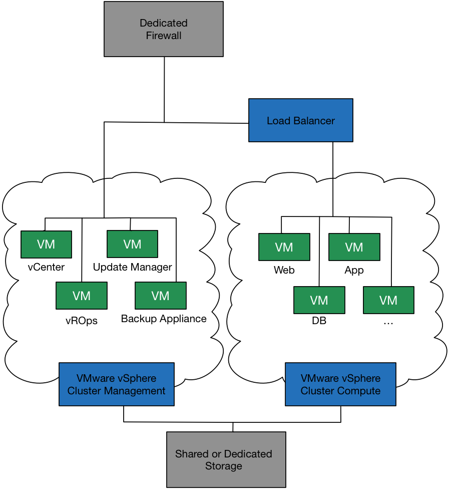

===============
Getting started
===============

This chapter provides the following information:

-  An overview of the Dedicated vCenter Server product

-  Components and features

-  Permissions

-  Rackspace support

-  Authentication methods

-  Optional Add-Ons

Product description
-------------------

Dedicated VMware® vCenter Server™ (Dedicated vCenter Server), offers you
the ability to quickly expand Data Center (DC) capacity without the need
for further CapEx investment. With direct access to the vSphere API, you
can use your existing scripts, and the same VMware and third-party tools
to easily manage the hosted VMware environment. Dedicated vCenter Server
improves agility by helping eliminate long procurement lead times so
that you can readily meet new business demands while maintaining
control. With over 14 years of managed hosting experience, Rackspace
provides around-the-clock proactive support and the VMware Certified
Professional expertise that you require.

Architecture
------------

The following diagram shows the architecture of the Dedicated vCenter
Server, including firewalls, load balancers, storage, and VM locations.

|Architecture|

Dedicated vCenter components
----------------------------

The Dedicated vCenter Server product comprises the VMware vSphere
cluster for management and VMware vSphere cluster for compute. The
following VMware services operate on a management cluster with two
hypervisors, which increases availability.

- vCenter Server

- Dedicated Virtual Machine Recovery (VMR) Virtual Appliance (Backup
  Appliance)

- vRealize Operations (vROps) Virtual Appliance

- VMware Update Manager (VUM) Virtual Appliance

- IP Allocation for VMs

  .. note::

     Access to these VMware services is limited to the user interface or
     API for vCenter Server, and vROps. Rackspace manages and maintains
     the servers running the Dedicated vCenter services.

The following VMware services operate on the management cluster.

+--------------------------------------+--------------------------------------+
| vCenter Server                       | Provides centralized visibility,     |
|                                      | proactive management and             |
|                                      | extensibility for VMware vSphere     |
|                                      | from a single console. Accessible    |
|                                      | via the java VI client, the vSphere  |
|                                      | Web Client and the vSphere API.      |
+--------------------------------------+--------------------------------------+
| Dedicated Virtual Machine Recovery   | VMR appliance enables image-based    |
| (VMR) Virtual Appliance (Backup      | backup of the management cluster     |
| Appliance)                           | VMs. This allows Rackspace to        |
|                                      | quickly recover management cluster   |
|                                      | VMs. This VMR appliance is for use   |
|                                      | only by Rackspace and will not back  |
|                                      | up any of the VMs created by         |
|                                      | customer on the compute cluster. No  |
|                                      | customer access is provided to the   |
|                                      | VMR appliance.                       |
+--------------------------------------+--------------------------------------+
| vRealize Operations Manager (vROps)  | vROps is a capacity management tool  |
| Virtual Appliance                    | that the customer can use to check   |
|                                      | the health of the hosted VMware      |
|                                      | environment, perform capacity        |
|                                      | planning or proactively eliminate    |
|                                      | performance bottlenecks.             |
+--------------------------------------+--------------------------------------+
| VMware Update Manager (VUM) Virtual  | VUM automates patch management and   |
| Appliance                            | eliminates manual tracking and       |
|                                      | patching of vSphere hosts. It        |
|                                      | compares the state of vSphere hosts  |
|                                      | with baselines then updates and      |
|                                      | patches hosts to enforce compliance. |
|                                      | Rackspace uses this system to        |
|                                      | maintain dedicated VMware services.  |
|                                      | No customer access is provided.      |
+--------------------------------------+--------------------------------------+
| IP Allocation for VMs                | Pre-determined IP blocks that are    |
|                                      | assigned to your account for the     |
|                                      | purpose of managing all virtual      |
|                                      | machines created.                    |
+--------------------------------------+--------------------------------------+

Dedicated vCenter features
--------------------------

The following table provides a list and description of Dedicated vCenter
features. As a Dedicated vCenter Server customer, you are granted the
permissions listed as "Customer" in the Responsibility column.

+--------------------+--------------+--------------------+--------------------+
| Feature            | Supported    | Responsibility     | Description        |
+====================+==============+====================+====================+
| vMotion            | Yes          | Customer           | Set up by          |
|                    |              |                    | Rackspace but the  |
|                    |              |                    | customer is        |
|                    |              |                    | responsible for    |
|                    |              |                    | executing          |
|                    |              |                    | migrations         |
+--------------------+--------------+--------------------+--------------------+
| Storage vMotion    | Yes          | Customer           | Enables live       |
|                    |              |                    | migration of       |
|                    |              |                    | virtual machine    |
|                    |              |                    | disk files within  |
|                    |              |                    | and across storage |
|                    |              |                    | arrays without     |
|                    |              |                    | service            |
|                    |              |                    | disruptions        |
+--------------------+--------------+--------------------+--------------------+
| High Availability  | Yes          | Rackspace          | HA clustering is   |
| (HA)               |              |                    | set up by          |
|                    |              |                    | Rackspace.         |
+--------------------+--------------+--------------------+--------------------+
| Data Protection    | No           |                    |                    |
+--------------------+--------------+--------------------+--------------------+
| Fault Tolerance    | No           |                    |                    |
+--------------------+--------------+--------------------+--------------------+
| vShield Endpoint   | No           |                    |                    |
+--------------------+--------------+--------------------+--------------------+
| vSphere            | No           |                    |                    |
| replication        |              |                    |                    |
+--------------------+--------------+--------------------+--------------------+
| Hot Add            | Yes          | Customer           | If a VM has a      |
|                    |              |                    | hot-add set, you   |
|                    |              |                    | can add or remove  |
|                    |              |                    | memory or CPU.     |
+--------------------+--------------+--------------------+--------------------+
| App HA             | No           |                    |                    |
+--------------------+--------------+--------------------+--------------------+
| Big Data           | No           |                    |                    |
| Extensions         |              |                    |                    |
+--------------------+--------------+--------------------+--------------------+
| Virtual Serial     | No           |                    |                    |
| Port Concentrator  |              |                    |                    |
+--------------------+--------------+--------------------+--------------------+
| Dynamic Resource   | Yes          | Rackspace          | DRS clustering is  |
| Scheduler (DRS)    |              |                    | set up by          |
|                    |              |                    | Rackspace.         |
+--------------------+--------------+--------------------+--------------------+
| Distributed Power  | No           |                    |                    |
| Management (DPM)   |              |                    |                    |
+--------------------+--------------+--------------------+--------------------+
| Storage DRS        | No           |                    |                    |
+--------------------+--------------+--------------------+--------------------+
| Profile Driven     | No           |                    |                    |
| Storage            |              |                    |                    |
+--------------------+--------------+--------------------+--------------------+
| Storage I/O        | No           |                    |                    |
| Control            |              |                    |                    |
+--------------------+--------------+--------------------+--------------------+
| Network I/O        | No           |                    |                    |
| Control            |              |                    |                    |
+--------------------+--------------+--------------------+--------------------+
| Single Root I/O    | No           |                    |                    |
| Virtualization     |              |                    |                    |
| (SR-IOV)           |              |                    |                    |
+--------------------+--------------+--------------------+--------------------+
| Flash Read Cache   | No           |                    |                    |
+--------------------+--------------+--------------------+--------------------+
| vStorage API       | Yes          | Rackspace          | VAAI is available  |
| for Array          |              |                    | if supported on    |
| Integration (VAAI) |              |                    | the storage array. |
+--------------------+--------------+--------------------+--------------------+
| Distributed Switch | No           |                    |                    |
+--------------------+--------------+--------------------+--------------------+
| Host Profiles      | No           |                    |                    |
+--------------------+--------------+--------------------+--------------------+
| Auto Deploy        | No           |                    |                    |
+--------------------+--------------+--------------------+--------------------+

Dedicated vCenter roles and permissions
---------------------------------------

Customers have the rights to create, delete, and manage VMs within their
Dedicated vCenter Server. Rackspace manages the ESXi hosts and the
vCenter Server. Customers therefore only have limited permissions on
hosts and servers. See the Appendix for a full list of permissions.

There are four pre-defined roles available in Dedicated vCenter:

- Customer Access

- VM Power User

- VM User

- Read Only

The following table lists a summary of vCenter Server permissions broken
down by the four available access roles.

.. list-table::
   :widths: 20 20 20 20 20
   :header-rows: 1

   * - Privileges
     - Customer Access
     - VM Power User
     - VM User
     - Read Only
   * - Alarms
     - Full Access
     - No Access
     - No Access
     - No Access
   * - Datastore
     - Full Access
     - Limited Access
     - No Access
     - No Access
   * - Folder
     - Full Access
     - No Access
     - No Access
     - No Access
   * - Network
     - Full Access
     - No Access
     - No Access
     - No Access
   * - Performance
     - Full Access
     - No Access
     - No Access
     - No Access
   * - Profile-Driven Storage
     - Full Access
     - No Access
     - No Access
     - No Access
   * - Resource
     - Full Access
     - No Access
     - No Access
     - No Access
   * - Scheduled Task
     - Full Access
     - Full Access
     - Full Access
     - No Access
   * - Tasks
     - Full Access
     - Full Access
     - Full Access
     - No Access
   * - vApp
     - Full Access
     - No Access
     - No Access
     - No Access
   * - Virtual Machine
     - Full Access
     - Full Access
     - Limited Access
     - No Access
   * - Datacenter
     - Limited Access
     - No Access
     - No Access
     - No Access
   * - Global
     - Limited Access
     - Limited Access
     - Limited Access
     - No Access
   * - Host
     - Limited Access
     - No Access
     - No Access
     - No Access
   * - Sessions
     - Limited Access
     - No Access
     - No Access
     - No Access
   * - Storage Views
     - Limited Access
     - No Access
     - No Access
     - No Access
   * - Datastore Cluster
     - No Access
     - No Access
     - No Access
     - No Access
   * - Distributed Virtual Switch
     - No Access
     - No Access
     - No Access
     - No Access
   * - Distributed Virtual Port Group
     - No Access
     - No Access
     - No Access
     - No Access
   * - ESX Agent Manager
     - No Access
     - No Access
     - No Access
     - No Access
   * - Extension
     - No Access
     - No Access
     - No Access
     - No Access
   * - vCenter Inventory Service
     - No Access
     - No Access
     - No Access
     - No Access
   * - VMware vSphere Update Manager
     - No Access
     - No Access
     - No Access
     - No Access
   * - VRM Policy
     - No Access
     - No Access
     - No Access
     - No Access
   * - vService
     - No Access
     - No Access
     - No Access
     - No Access

Rackspace support services
--------------------------

Rackspace provides specific support for the Dedicated vCenter Server
environment and virtual machines that are built from vCenter
environments.

Infrastructure support
    Rackspace delivers Fanatical Experience™ for the hardware
    infrastructure resources including Network, Server, and Storage
    components.

VMware virtualization services
    Rackspace is one of VMware's largest global vCloud Air Network
    partners, with elevated access to technical specialists for rapid
    resolution of unexpected software-related issues within the VMware
    stack.

    Rackspace's VMware Certified Professionals (VCPs) assist in the
    architecture, deployment, and troubleshooting of the Dedicated
    vCenter Server environment. Rackspace monitors and maintains the
    VMware software stack, including installing and configuring the
    vCenter Server and vROps appliance, backing up the VMware service
    VMs, and monitoring the hypervisors.

Virtual machines
    Virtual machines created by you within the Dedicated vCenter Server
    environment do not have Rackspace Guest OS support. Services such as
    monitoring, OS Patching, anti-virus and backups are your
    responsibility.

Authentication methods
======================

As a Dedicated vCenter customer you have two choices for vCenter
authentication. Please indicate which you prefer and provide any relevant
details.

1. Rackspace hosted Active Directory (Intensive.int)

    - Provide a list of user names for accounts to be created.

    - If these users will have different roles, please indicate one of the
      roles provided in the roles section for each user.

2. Customer maintained Active Directory

   .. note::

      Rackspace support still authenticates to your Dedicated vCenter
      with the Rackspace hosted Active Directory. Your directory
      service will be added as an additional authentication.

    - Identity source type: Active Directory as a LDAP Server

    - Name: Customers Domain

    - Base DN for users: <example: ou=vcusers; ou=allusers; dc=domain; dc=name>

    - Domain name: <your domain>

    - Domain alias (this is the NetBIOS name of the domain, so alias\\username
      is the login): <domain>

    - Base DN for groups: <example: ou=vcgroups; ou=allusers; dc=domain;
      dc=name>

    - Primary server URL: ldap://customer-ldap-fqdn:3268 (Please ensure your
      Dedicated vCenter is allowed to communicate with this server)

    - Authentication type: Password

    - Username: <provide a Rackspace account for this service>

Please indicate the groups and roles to be assigned in vCenter from the
vCenter roles available in the roles section.

Optional Add-Ons
----------------

Managed Backup (MBU)
====================

The following table provides a list and description of MBU
features. As a Dedicated vCenter Server customer, you are granted the
permissions listed as "Customer" in the Responsibility column.

.. list-table::
   :widths: 25 25 25 25
   :header-rows: 1

   * - Feature
     - Supported
     - Responsibility
     - Description
   * - File Level Restore
     - No
     -
     -
   * - Image Level Restore (management)
     - Yes
     - Rackspace\*
     - Rackspace managed infrastructure request can only be initiated by Rackspace (\*Except in vROps)
   * - Image Level Restore (compute)
     - Yes
     - Customer
     - Initiate restore request via ticket
   * - Application Specific Restore
     - No
     -
     -

