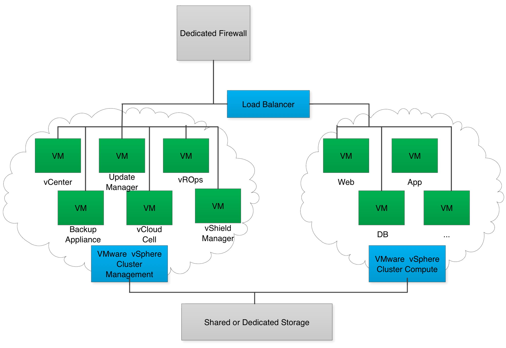

============
Architecture
============

The Dedicated vCloud service uses a software suite that creates an
abstraction layer on top of VMware vCenter Servers. This software makes
creating virtual machines (VMs) for a variety of workloads easy.
Rackspace configures the infrastructure, sets up virtual networks, and
establishes storage policies. With the Rackspace catalog of vApp
templates in the vCloud Director web portal, you can create VMs for
testing, development, or production.

Rackspace can help you set cloud policies that control how resources are
used. Optionally, you can segregate business units or groups of users
into "organizations" within the hosted private cloud. Users can
provision resources in this application, where they have access to vApps
and the resources used by vApps, without involving IT.

While Rackspace does not impose a limit on the number or size of virtual
machines in your Dedicated vCloud environment, Rackspace can provide
recommendations for best practices to maintain optimal performance. You
are also encouraged to use vRealize Operations to monitor usage and
performance trends in your Dedicated vCloud environment.

The Dedicated vCloud service can only be used to provision virtual
machines on the resources provided to you by Rackspace. It is not
possible to add your on-premises vSphere resources to Dedicated vCloud.

Since Rackspace manages and maintains the Dedicated vCloud product
VMware services and infrastructure resources, any changes to settings or
configurations of the VMware-hosted services, networking, storage, and
compute systems must be requested by opening a ticket with Rackspace
Support.

As Dedicated vCloud provides a portal for virtual machine management,
the My Rackspace portal will only allow you to view physical gear.
Compute VMs are viewable only in the vCloud Director portal and vCloud
API. VM management is only available when using the vCloud Director
portal or vCloud API.

..  note::
    Raw Device Mapping for virtual machine disks is not supported in the
    vCloud Director platform.

The following diagram shows the architecture of the Dedicated vCloud
product, including firewalls, load balancers, storage, and VM locations.

