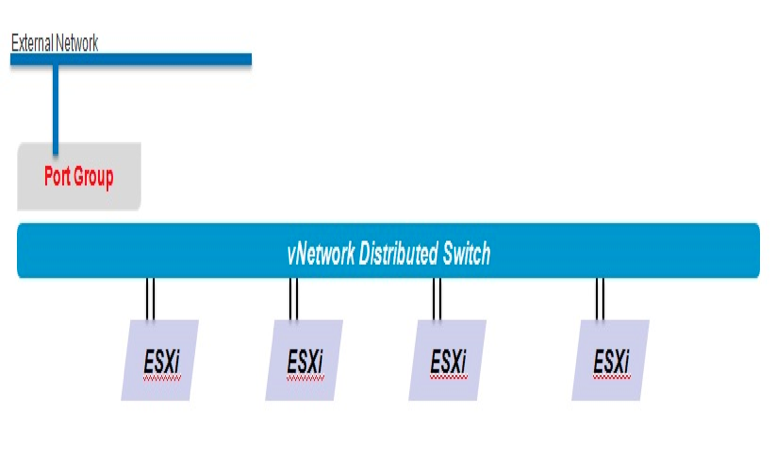

=====================
Working with networks
=====================

External networks, along with network pools, comprise the building blocks of
the Dedicated vCloud network infrastructure.

Dedicated vCloud only supports the use of:

- External networks

- Direct Organization networks

- Port-group backed network pools with Static IP pool assignments

External networks
~~~~~~~~~~~~~~~~~

External networks are the foundation of organization networks. If the
organization network must access a corporate network or the Internet, it
will move along an external network. Configuring an external network
requires pre-configuration in vCenter and for all hosts to have access
to the new port group. Once this is completed, the external network can
be added to Dedicated vCloud.

Setting up an external network requires the following layer 3
information:

- Gateway

- Subnet mask

- DNS address

- IP address

This information is abstracted from the end user, and used to provide
VMs with direct connection to the external network. The pool of IP
addresses is reserved for use only with Dedicated vCloud.

.. warning::
   If these addresses are not reserved and are used outside of Dedicated
   vCloud, network conflicts will occur.

Organization networks
~~~~~~~~~~~~~~~~~~~~~

An Organization is a logical representation of a tenant in Dedicated
vCloud. End users and resources are allocated and defined here. In each
Organization, only Direct networks can be configured.

Direct network
 Direct networks connect an organization to an external network by
 directly connecting to a port group where the external network is. A
 VM will use one IP address from a list of IP addresses that is
 configured when the network is created.

 .. image:: ../figures/vCloudnetworking-vDCnetwork.png
    :alt: **Organization networks**

Network pools
~~~~~~~~~~~~~

A network pool is a group of network resources that can only be used by
an Organization. These can be either logical or physical networking
resources.

The network pool shares the IP address pool with organization and vApp
networks for NAT routing. Dedicated vCloud supports the following type
of network pools that can be used by vApps:

Port-group backed
 Port-group backed pools require pre-created port-groups within the
 vSphere environment.

 Rackspace uses a port-group backed layer 2 network, which enables
 autonomous control of the network resources and ease of
 configuration.

Virtual machines IP management
~~~~~~~~~~~~~~~~~~~~~~~~~~~~~~

Dedicated vCloud can be configured to allocate local private IP
addresses to VMs automatically, allowing you to manually specify an IP
address, or make use of a DHCP server for IP address allocation. When
assigning a VM an IP address, there are three options:

- Static IP Pool

- Static manual

- DHCP

The following image shows the options for IP Mode and the pull down for
choosing the Network:

.. figure:: ../figures/vcloudnetworks-IPmanagement.png
   :alt: **Selecting a network**

Static IP pool
 This is a pool of IP addresses that is defined when the newly
 created network is connected. A private IP Pool is created when a
 Routed Network, Internal Network or a vApp Network is created.
 Connecting the vNIC to a network with Static IP pool selected it
 automatically pulls an IP from the pool at Guest Customization time
 and considers it a static IP.

DHCP
 This is standard DHCP services usually provided by a vShield Edge if
 it is a vApp network or a Routed Network. When the vNIC starts it
 will request a DHCP lease from the network. When it reaches half its
 lease it will request an extension. When it is not used and the
 lease expires the address will be returned back to the pool.

Static manual
 This is manually assigning an IP to the vNIC providing it an IP
 address and subnet mask. The IP address will be persistent until it
 is changed.

Virtual machine public IP management
~~~~~~~~~~~~~~~~~~~~~~~~~~~~~~~~~~~~

With Dedicated vCloud, you receive a CSV file with the NAT relationship
between a group of local private IP addresses and public IP addresses
that is configured on your physical firewall. This local private IP
address range is configured in Dedicated vCloud as an IP Pool for your
use. When an IP address is assigned to a VM using this pool, you can
refer to the CSV file to see it’s public IP NAT relationship. To
configure access rules using this public IP, log in to the My Rackspace
portal and use the Firewall Manager.
