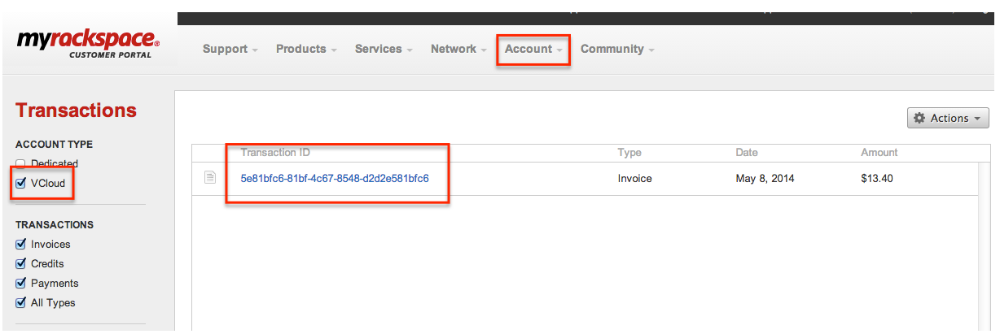

===============================
Detailed usage report in MyRack
===============================

The monthly invoice displays one line item per virtual machine created
during the billing period. A monthly detailed usage report provide
additional details about how invoiced line items are calculated.

Access the detailed usage report by logging into the MyRackspace.com
portal. Select **Transactions** from the account menu. Select the
**vCloud** account type on the left pane to see the available reports.
The following graphic shows the user interface.

From the list of usage reports, click on the transaction ID of the
report to view it. A ``.csv`` file is generated and displayed, and you
can save or export the report. The usage report includes a record for
each usage event captured for each VM created. The following table
provides a description for each field in the report:

Usage report table
------------------

.. list-table::
   :widths: 33 33 33
   :header-rows: 1

   * - Usage report item
     - Description
     - Notes
   * - ACCOUNT_NUMBER
     - The usage report is generated for one account number.
     -
   * - CHARGE
     - The total amount charged or discounted for this line item.
     -
   * - CHARGE_TYPE
     - This field shows whether the usage event was a charge or a discount to be calculated in the VM monthly price.
     -
   * - DC_ID
     - This ID corresponds to the physical Rackspace data center containing the virtual machine.
     - Multiple data center IDs are listed if the account contains multiple Dedicated VMware vCloud environments deployed in multiple Rackspace data centers.
   * - END_DATE
     - The last date of the billing invoice period.
     -
   * - EVENT_TYPE
     - These events describe the type of usage recorded for each VM: OS license, OS support, application license, application support.
     - A maximum of one event type per VM per day is recorded. If no applications are added, no application event types are recorded. No OS support event types are recorded for unsupported virtual machines.
   * - GEO_ID
     - The geographic location where the usage is collected.
     -
   * - QUANTITY
     - The number of hours that the virtual machine is powered on or in a suspended state.
     -
   * - RATE_TAG
     - The rate for which the event type is charged (or discounted).
     -
   * - REGION_ID
     - The region code for the geographic location where the usage is collected.
     -
   * - RES_ID
     - The device ID number generated for the virtual machine in Rackspace internal systems.
     -
   * - RES_NAME
     - The system name assigned to the device number for the virtual machine in Rackspace internal systems.
     -
   * - SERVICE_TYPE
     - The product that the usage was generated for. The detailed usage report displays the Dedicated VMware vCloud service type.
     -
   * - START_DATE
     - The first date of the billing invoice period.
     -
   * - vCPU
     - The amount of virtual CPUs deployed for the Virtual Machine from vCloud.
     -
