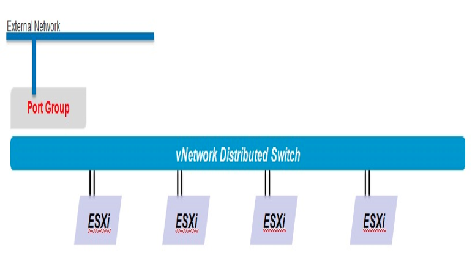

============================
Working with vCloud networks
============================

The following network information is for reference and not all of it
applies to Dedicated vCloud. At this time, Dedicated vCloud supports
only the use of:

-  External networks

-  Direct Organization networks

-  Port-group backed network pools with Static IP pool assignments

These networks, along with network pools and IP management for virtual
machines, comprise the building blocks of the vCD infrastructure.

See the following sections for more information.

External networks
~~~~~~~~~~~~~~~~~

External networks are the foundation of organization networks. If the
organization network must access a corporate network or the internet, it
will move along an external network. Configuring an external network
requires preconfiguration in vCenter and for all hosts to have access to
the new port group. Once this is completed, the external network can be
added to vCD.

Setting up an external network requires the following layer 3
information:

-  Gateway

-  Subnet mask

-  DNS address

-  IP address

This information is abstracted from the end user, and used to provide
VMs with direct connection to the external network. The pool of IP
addresses is reserved for use only with vCD.

.. warning::

   If these addresses are not reserved and are used outside of vCD, network
   conflicts will occur.

Organization networks
=====================

An Organization is a logical representation of a tenant in vCD. End
users and resources are allocated and defined here. In each
Organization, three types of networks that can be configured.

 Direct network
    Direct networks connect an organization to an external network by
    directly connecting to a port group where the external network is. A
    VM will use one IP address from a list of IP addresses that is
    configured when the network is created. A vShield edge can be
    deployed between the vApp and the external network to provide NAT
    service and route to the external network.

 Routed network
    A routed network is a dedicated layer 2 network that is a routed to
    an external network through a vShield Edge. vCD deploys a vShield
    Edge when this network is created and provides services that include
    DHCP, NAT, Router, Firewall, Load balancing and DNS relay. Routed
    networks use IPs from network pools.

 Internal network (isolated)
    An internal network is internal to the organization. It does not
    connect to any external networks and essentially is isolated. vApps
    connected to this network can only talk with other vApps on the same
    network. However, internal networks can span between organizations
    if needed.

.. image:: ../figures/vcloudnetworks-organizationnetworks.png

vApp networks
~~~~~~~~~~~~~

vApp networks are isolated to a single vApp. They cannot span across
vApps unless it they connected to an organization network through a
routed or direct connection. If a vApp network is going to be a routed
network, a vShield Edge is automatically deployed to provude NAT
services when the vApp is powered on. When connected to a routed
network, a network pool is required. However, a vApp network does not
need to connect to an organization network, which enables an isolated
network.

Network pools
~~~~~~~~~~~~~

A network pool is a group of network resources that can only be used by
a vCloud Organization. These can be either logical or physical
networking resources.

The network pool shares the IP address pool with organization and vApp
networks for NAT routing. vCloud supports three types of network pools
that can be used by vApps.

 Port-group backed
    Port-group backed pools require pre-created port-groups within the
    vSphere environment. Port-group backed pools do not require vDS and
    can be based on vSS, vDS or Cisco Nexus 1000v.

    Rackspace uses a port-group backed layer 2 network, which enables
    autonomous control of the network resources and ease of
    configuration.

 VLAN backed
    VLAN-backed network pools require a set of unused VLANs. When an Org
    or vApp network based on a VLAN-backed pool is created, a port-group
    is created on a dvSwitch and a VLAN is assigned to this port-group.

 vCD-NI backed
    vCloud Network Isolation-backed (VCNI) network pools are flexible,
    easy to configure and do not require VLANs. vCNI provides layer 2
    isolation by utilizing a network overlay. This network overlay is
    provided by MAC in MAC encapsulation and requires a vDS. For each
    consumed network vCloud Director creates a port-group and assigns
    this port-group a network ID number. This network ID number is used
    for the encapsulation of the traffic.

    Because vCD uses MAC in MAC for the encapsulation of traffic, vCD-NI
    requires an increase in the MTU of the underlying transport network
    (dvSwitch). This avoids frame fragmentation caused by the minor
    overhead in MAC encapsulation.

..  note::

    Rackspace Support Item: To ensure that Rackspace automation and support
    services have time to properly decommission the IP address associated
    with a deleted VM from our systems, Rackspace will set the IP address
    release timeout to 24 hours. A longer timeout can be requested, but a
    timeout cannot be requested less than the Rackspace default.

..  note::

    Rackspace Support Item: Port-group backed is the only network pool type
    available in Dedicated vCloud at this time. Rackspace is working to
    provide more advanced network functionality with NSX integration for
    vCloud.

Virtual machines IP management
~~~~~~~~~~~~~~~~~~~~~~~~~~~~~~

vCloud can be configured to allocate IP addresses to VMs automatically,
allow you to manually specify an IP address, or make use of a DHCP
server for IP address allocation. When assigning a VM an IP address,
there are three options:

-  Static IP Pool

-  Static manual

-  DHCP

.. note::

   Rackspace Support Item: Only the Static IP Pool mode is supported with
   Rackspace automation for Dedicated VMware vCloud at this time. We are
   working to provide more advanced network functionality with NSX
   integration for vCloud.

The following image shows the options for IP Mode and the pull down for
choosing the Network:

.. image:: ../figures/vcloudnetworks-IPmanagement.png

Static IP pool
    This is a pool of IP addresses that is defined when the newly
    created network is connected. A private IP Pool is created when a
    Routed Network, Internal Network or a vApp Network is created.
    Connecting the vNIC to a network with Static IP pool selected it
    automatically pulls an IP from the pool at Guest Customization time
    and considers it a static IP.

DHCP
    This is standard DHCP services usually provided by a vShield Edge if
    it is a vApp network or a Routed Network. When the vNIC starts it
    will request a DHCP lease from the network. When it reaches half its
    lease it will request an extension. When it is not used and the
    lease expires the address will be returned back to the pool.

Static manual
    This is manually assigning an IP to the vNIC providing it an IP
    address and subnet mask. The IP address will be persistent until it
    is changed.
