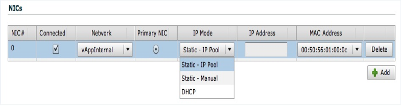

:orphan:

==============================
Virtual machines IP management
==============================

vCloud can be configured to allocate IP addresses to VMs automatically,
allow you to manually specify an IP address, or make use of a DHCP
server for IP address allocation. When assigning a VM an IP address,
there are three options:

-  Static IP Pool

-  Static manual

-  DHCP

.. note::

   Rackspace Support Item: Only the Static IP Pool mode is supported with
   Rackspace automation for Dedicated VMware vCloud at this time. We are
   working to provide more advanced network functionality with NSX
   integration for vCloud.

The following image shows the options for IP Mode and the pull down for
choosing the Network:

Static IP pool
    This is a pool of IP addresses that is defined when the newly
    created network is connected. A private IP Pool is created when a
    Routed Network, Internal Network or a vApp Network is created.
    Connecting the vNIC to a network with Static IP pool selected it
    automatically pulls an IP from the pool at Guest Customization time
    and considers it a static IP.

DHCP
    This is standard DHCP services usually provided by a vShield Edge if
    it is a vApp network or a Routed Network. When the vNIC starts it
    will request a DHCP lease from the network. When it reaches half its
    lease it will request an extension. When it is not used and the
    lease expires the address will be returned back to the pool.

Static manual
    This is manually assigning an IP to the vNIC providing it an IP
    address and subnet mask. The IP address will be persistent until it
    is changed.
