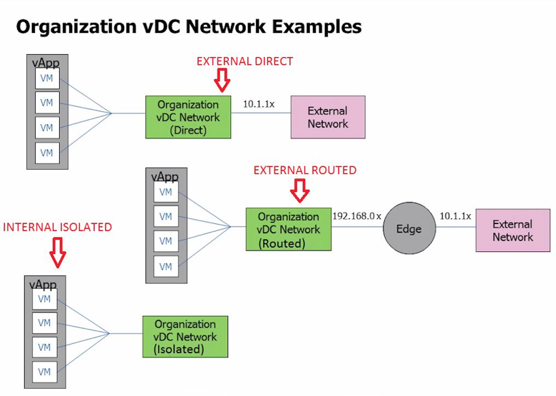

:orphan:

=====================
Organization networks
=====================

An Organization is a logical representation of a tenant in vCD. End
users and resources are allocated and defined here. In each
Organization, three types of networks that can be configured.

 Direct network
    Direct networks connect an organization to an external network by
    directly connecting to a port group where the external network is. A
    VM will use one IP address from a list of IP addresses that is
    configured when the network is created. A vShield edge can be
    deployed between the vApp and the external network to provide NAT
    service and route to the external network.

 Routed network
    A routed network is a dedicated layer 2 network that is a routed to
    an external network through a vShield Edge. vCD deploys a vShield
    Edge when this network is created and provides services that include
    DHCP, NAT, Router, Firewall, Load balancing and DNS relay. Routed
    networks use IPs from network pools.

 Internal network (isolated)
    An internal network is internal to the organization. It does not
    connect to any external networks and essentially is isolated. vApps
    connected to this network can only talk with other vApps on the same
    network. However, internal networks can span between organizations
    if needed.

